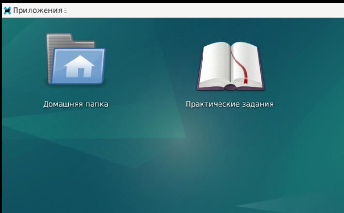

Используйте готовые шаблоны ВМ LPIC101-deb-tmplt и LPIC101-fed-tmplt или подготовьте их по инструкции.

1. Создать две ВМ. Дистрибутивы Almalinux (или Fedora) и Debian. Образы взять из:
https://almalinux.org/get-almalinux/#ISO_Images
https://www.debian.org/download

Характеристики ВМ(минимально рекомендуемые): CPU 2 ядра, 2Gb RAM, 20Gb HDD, 5Gb HDD.

При установке Almalinux рекомендуется:
- имя компьютера: s1-alma.mt.local
- выбор программ: Сервер с GUI, + Удаленное управление linux, консольные средства Интернета, управление системами без графической консоли, системные средства
- пользователь (сделать администратором): sa
- пароль: pass
- Разбиение диска (можно все на один раздел, рекомендовано с lVM): / - 12Gb, /var -4Gb, /boot - 1Gb, /home - 1Gb, swap - 1Gb

При установке Debian рекомендуется:
- имя компьютера: s2-deb.mt.local
- выбор программ: окружение рабочего стола Debian, XFCE, SSH-сервер, стандартные системные утилиты
- пользователь (сделать администратором): sa
- пароль: pass
- Разбиение диска: можно все на один раздел

2. На оба сервера установить пакеты для работы с git.
3. Склонировать скрипты развертывания: `git clone https://github.com/dRumata/stendprep/`

4. На Debian выполнить скрипт `stendprep/debprep.sh`

5. На Almalinux выполнить скрипт `stendprep/almaprep.sh`

6. Настройте локальный сайт с заданиями для слушателя на ВМ Debian (необязательно, можно использовать версию на https://github.com/drumata/MT_LPIC-101/):

6.0. Запустите на Debian скрипт `stendprep/labglocal.sh`

Процесс можно прервать после вывода строки `Starting new Web server: tcp:0.0.0.0:3000` если он не перешел в фоновый режим автоматически.

6.1. Перейдите на страницу http://s2-deb.mt.local и заполните поля:

  - домен сервера: s2-deb.mt.local
  - Базовый URL Forgejo: http://s2-deb.mt.local/
  
6.2. Нажать "установить forgejo"

6.3. Зарегистрировать аккаунт (на открывшейся странице заполните 4 поля):

  - sa
  - sa@mt.local
  - password
  - password
  
6.4. Добавить зеркало репозитория с заданиями: "плюс" справа сверху --> "новая миграция"
  
  - выбрать Github иконку в центре и на открывшейся странице заполните 3 поля:
  - перенос URL: https://github.com/dRumata/MT_LPIC-101
  - параметры миграции: "V"  Этот репозиторий буждет зеркалом
  - название репозитория: LPIC101-labs
  
6.5. Нажать "Перенос репозитория". После создания зеркала в настройках репозитория рекомендуется уменьшить время синхронизации зеркала до 10минут.

7. Сообщите адрес локального сервера git слушателям. Порекомендуйте добавить строку для разрешения имени в **/etc/hosts** Например: 'IP_адрес_тренера labs.local' или 'IP_адрес_s2-deb labs.local'

8. Практические задания доступны c пользовательских fedora-серверов по адресу http://s2-deb.mt.local/sa/LPIC101-labs или http://labs.local/sa/LPIC101-labs (если настроили адрес в /etc/hosts) или http://localhost/sa/ непосредственно на debian-сервере слушателя курса.

9. В шаблоне debian-сервера учебник уже доступен по ссылке с рабочего стола.
